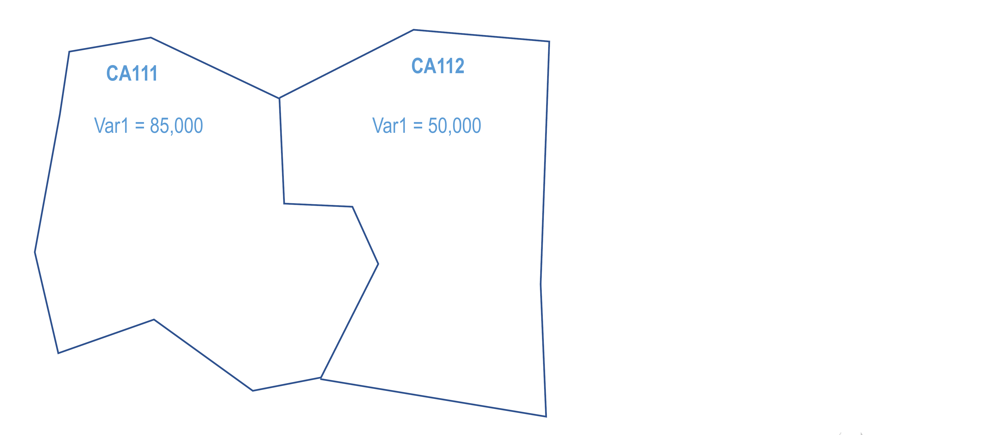
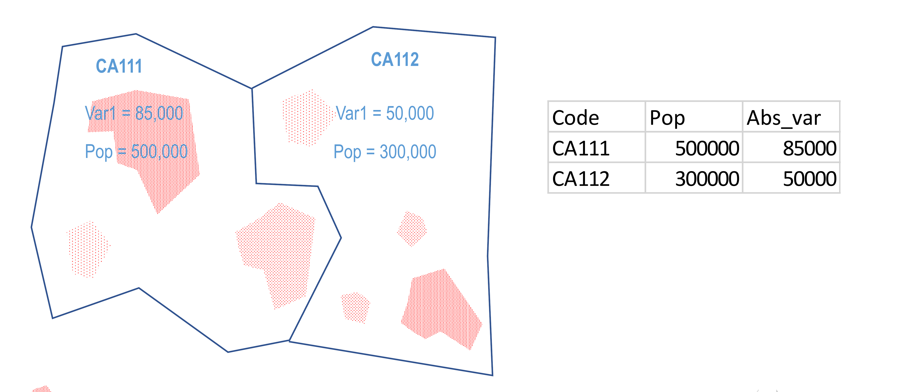
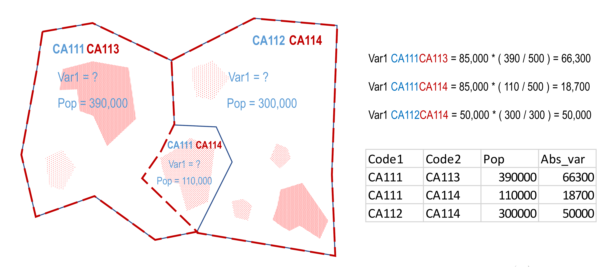
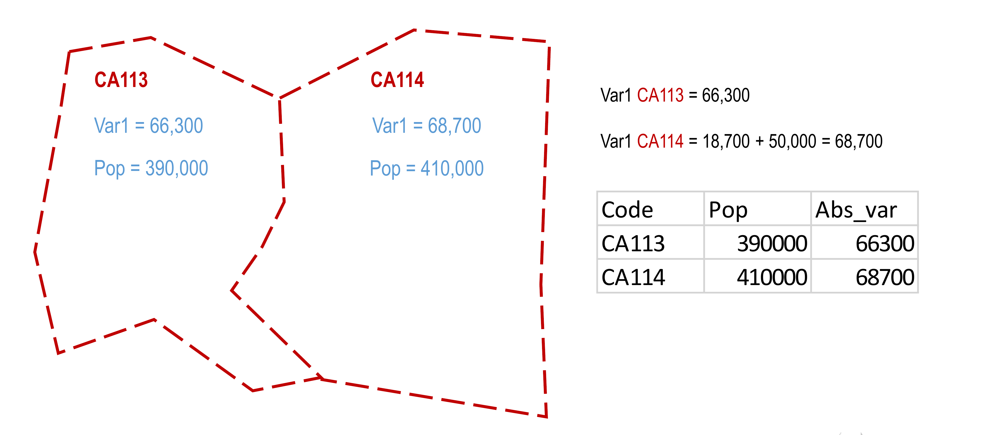
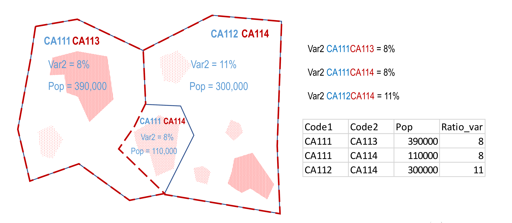
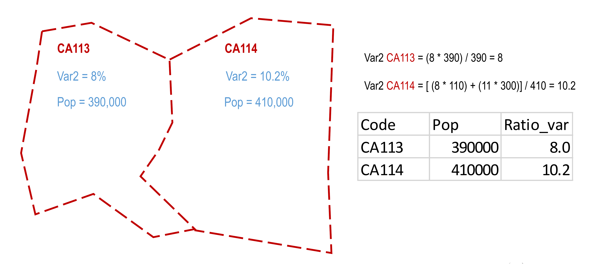

```{r}
#| label: setup-intext
#| echo: false
#| include: false

# All numbers quoted in the body of this article are computed by the scripts in
# codes/ and consolidated into a single data file (codes/intext_numbers.R).
# They are displayed below via inline R so the prose can never drift from the
# analysis. To regenerate: Rscript codes/run_all.R && Rscript codes/intext_numbers.R
nums <- readRDS("data/stats/intext_numbers.rds")

# Thousands-separated integer formatter for inline use.
fmt <- function(x) formatC(round(as.numeric(x)), format = "d", big.mark = ",")
# Percentage formatter (drops the trailing name a vector subscript would carry).
pct <- function(x, digits = 1) sprintf(paste0("%.", digits, "f"), as.numeric(x))
```


## Background & Summary {.unnumbered}

The Nomenclature of Territorial Units for Statistics (NUTS), established by the European Union as the standard geocoding system for referencing administrative divisions, serves as the foundational framework for regional analysis across Europe. Eurostat releases all regional official statistics at the NUTS level, making this classification system essential for comparative socioeconomic research. However, the NUTS classification has undergone major revisions in 2006, 2010, 2013, 2016, 2021, and 2024 to accommodate demographic, economic, and political changes. As illustrated in @fig-revisions, boundary modifications offer limited compatibility, preventing researchers from directly comparing regional data collected under different NUTS versions.[^backward] As a consequence, individual scientists have developed their own aggregations, spatial interpolation methods and conversion weights to harmonize data across classification versions—an approach that substantially limits the reproducibility and comparability of research findings.[^repro]

{#fig-revisions width=80%}


[^backward]: For example, more recent regional input-output tables for 2008-2018 by @huang2023european could only be merged with data from 2000-2010 by @thissen2018euregio when harmonizing the underlying NUTS 2 classifications used.

[^repro]: Recent examples are @becker2018effects who construct regional GDP per capita at the NUTS2 level from 1989 to 2013 or @schraff2023european who build election results at NUTS3 level from 1990 to 2019.

This study presents a methodology, dataset and software for converting European regional data between NUTS versions and hierarchical levels using dasymetric spatial interpolation. Our approach relies on high-resolution geographical data of administrative boundaries and grids (100m $\times$ 100m) to create precise conversion weights based on six distinct spatial distributions: regional area, computed directly from the boundary geometry, and five raster-derived weights — population counts for 2011 and 2021, artificial surfaces for 2012 and 2018, and residential built-up volume in 2021. This multi-weight approach allows researchers to select the most appropriate interpolation method based on their specific variables and research questions.

The dataset covers all administrative boundary changes across NUTS versions for all European Union member states, EFTA members, and — for versions prior to 2024 — the United Kingdom (see @tbl-country-coverage). These conversion tables capture not only simple one-to-one territorial transformations but also complex scenarios involving regional splits, mergers, and partial boundary adjustments. The methodology handles both absolute variables (such as counts or totals) and relative variables (such as rates or densities) through distinct interpolation procedures.


```{r}
#| echo: false
#| warning: false
#| label: tbl-country-coverage
#| tbl-cap: "**Country Coverage**"


library(tidyverse)
library(kableExtra)
tbl_data <- read_csv("data/country_coverage_summary.csv") %>%
  set_names("Country Code", "Country Name", "Status", "Coverage Note")
if (knitr::pandoc_to("docx")) {
  kable(tbl_data, booktabs = TRUE, linesep = "")
} else {
  kable(tbl_data, booktabs = TRUE, linesep = "") %>%
    kable_styling(font_size = 9) %>%
    column_spec(1, width = "1.5cm") %>%
    column_spec(2, width = "2cm") %>%
    column_spec(3, width = "4.5cm") %>%
    column_spec(4, width = "7cm") %>%
    footnote(
      general = "Coverage status and notes reflect the NUTS versions for which conversion weights are available for each country.",
      general_title = "Note:",
      footnote_as_chunk = TRUE,
      threeparttable = TRUE
    )
}

```


The primary output consists of conversion tables that support the conversion of variables between any two NUTS versions in either direction and facilitate the aggregation from lower to higher hierarchical levels (NUTS-3 to NUTS-2 or NUTS-1). Additionally, we propose tools that rely on these tables: an online converter that allows users to upload datasets and receive converted outputs, and an open-source R package that implements the conversion framework for offline use. This framework accommodates mixed-version datasets commonly encountered in Eurostat releases, where different countries or time periods may employ different NUTS classifications.

The potential reuse value extends across multiple disciplines including regional studies, social sciences, and environmental studies. Researchers can now conduct uninterrupted time-series analyses of regional indicators across Europe such as value added, employment rates, innovation metrics, demographic trends, and environmental quality measures. Multiple weights allow for robustness checks by enabling researchers to examine how different interpolation weights might affect their conclusions. Furthermore, the conversion framework provides essential infrastructure for the development of harmonized European regional databases that can support evidence-based policymaking at both national and EU levels. This work addresses a fundamental challenge in European regional research and establishes a reproducible standard for handling administrative boundary changes in longitudinal spatial analysis.


## Methods {.unnumbered}


### Construction of Conversion Tables

The conversion tables enable the interpolation of regional statistics between different NUTS versions. @fig-workflow visualizes our workflow in two stages: a geometric intersection stage and a raster overlay stage.

{#fig-workflow width=50%}

In stage one, we intersect the boundaries of NUTS regions from two distinct versions (e.g., NUTS 2016 and NUTS 2021). We rely on NUTS level 3 administrative boundaries at the scale 1:100 000 [@EuroGeographics2024]. We generate a set of transition regions - the finest spatial units that are internally consistent with respect to both boundary systems. Each transition region inherits the NUTS codes of its two parent regions, which are concatenated to form a unique identifier (e.g., BE211-BE236). Polygons below 1 km² are discarded as geometric slivers before NUTS codes are assigned.[^slivers] Where the intersection produces multiple polygons sharing the same pair of parent codes — for instance, due to non-contiguous regional geometries or residual fragmentation after sliver removal — these are dissolved into a single multipart feature per unique identifier.

[^slivers]: These imprecisions may arise from technical improvements in boundary precision over time, or from movements of natural boundaries such as rivers.

Each transition region is overlaid with 100 m × 100 m raster grids covering five ancillary variables used as proxies for the spatial distribution of socioeconomic activity: population counts in 2011 and 2021,[^popraster] artificial surface coverage for 2012 and 2018 [@JRC_ArtificialSurfaces_2012; @JRC_ArtificialSurfaces_2018], and built-up volume in 2021 [@GHSL_BuiltVolume_2023]. For each raster layer and each transition region, the raster cell values falling within the region's boundary are summed to produce an aggregate. These aggregates form the basis for computing interpolation weights, together with the area of each transition region computed directly from the boundaries. In a final step we aggregate the weights obtained for NUTS level 3 to levels 2 and 1 for each combination of NUTS versions. The resulting table of weights can then be applied to any statistic defined over the source NUTS version to produce an estimate on the target version.

[^popraster]: The JRC-ESTAT population grids use dasymetric mapping to disaggregate 1km grid maps to a resolution of 100 x 100m using proxy data [@BatistaeSilva2013]. The population grid is available for 2021 [@Pigaiani2026]. 2011 relies on the same methodology but is currently not available publicly.


### Converting Variables in Absolute Values

The conversion tables are used in a dasymetric areal interpolation framework to redistribute statistical values when regional boundaries change between classification versions.

The conversion of variables measured in absolute values requires distributing the source region's value across the target regions proportionally according to the chosen covariate. This approach assumes that the statistical variable is distributed in space according to the same pattern as the covariate.

Consider the conversion of an absolute variable $x^{s}_i$ from a NUTS source version $s$ to $x^{t}_j$ in target version $t$, where $s, t \in \{2006, 2010, 2013, 2016, 2021, 2024\}$. We convert the variable using a conversion table $W^{s,t}$ which contains transition weights $w_{ij}^{s,t}$ for a combination of NUTS versions $s$ and $t$. These weights represent the flow of area, population, artificial surface, or built-up volume from transition region $i$ to $j$. The absolute variable $x^{t}_j$ is converted as follows

$$
x^{t}_j = \sum_i^{n} x^{s}_i \frac{w_{ij}^{st}}{\sum_j^{m} w_{ij}^{st}}
$$

where $n$ is the number of source regions $i$ contributing to target region $j$, and $m$ is the number of target regions $j$ receiving from source region $i$. The weight share $\frac{w_{ij}^{st}}{\sum_j^{m} w_{ij}^{st}}$ is one if region $j$ in the target version takes up the entire source region $i$, such as in the case of mergers or no boundary changes ($m=1$ and $n\geq1$). Otherwise the weight share is smaller than one and larger than zero.

We illustrate this conversion with an example in @fig-absolute-example where two source regions, CA111 and CA112, contain population and a variable of interest measured in absolute terms. Region CA111 has a population of `{r} fmt(nums$ex$pop_ca111)` and a value of `{r} fmt(nums$ex$abs_ca111)` for the variable, while region CA112 has a population of `{r} fmt(nums$ex$pop_ca112)` and a value of `{r} fmt(nums$ex$abs_ca112)`. When the NUTS classification is revised, these boundaries change such that the territory is reorganized into two new regions: CA113 and CA114.

The conversion process begins by calculating how the population of each source region is distributed across the new regional boundaries. Using population as the covariate, we determine that `{r} fmt(nums$ex$pop_111_113)` inhabitants of CA111 fall within the new CA113 boundary, while `{r} fmt(nums$ex$pop_111_114)` inhabitants of CA111 fall within CA114. The entirety of CA112's population (`{r} fmt(nums$ex$pop_112_114)`) is incorporated into CA114.

To convert the variable values, we apply proportional allocation based on these population distributions. For the portion of CA111 that becomes CA113, the converted value is calculated as `{r} fmt(nums$ex$abs_ca111)` × (`{r} fmt(nums$ex$pop_111_113)` / `{r} fmt(nums$ex$pop_ca111)`) = `{r} fmt(nums$ex$abs_113)`. Similarly, the portion of CA111 that contributes to CA114 yields `{r} fmt(nums$ex$abs_ca111)` × (`{r} fmt(nums$ex$pop_111_114)` / `{r} fmt(nums$ex$pop_ca111)`) = `{r} fmt(nums$ex$abs_114_f111)`. The contribution from CA112 to CA114 is straightforward, as the entire region is absorbed: `{r} fmt(nums$ex$abs_ca112)` × (`{r} fmt(nums$ex$pop_112_114)` / `{r} fmt(nums$ex$pop_ca112)`) = `{r} fmt(nums$ex$abs_114_f112)`.

The final step involves aggregating contributions to each target region. Region CA113 receives only one contribution (from CA111), resulting in a final value of `{r} fmt(nums$ex$abs_113)`. Region CA114, however, receives contributions from both source regions, and these are summed to produce the final value: `{r} fmt(nums$ex$abs_114_f111)` + `{r} fmt(nums$ex$abs_114_f112)` = `{r} fmt(nums$ex$abs_114)`. The resulting dataset shows CA113 with a population of `{r} fmt(nums$ex$pop_113)` and a variable value of `{r} fmt(nums$ex$abs_113)`, while CA114 has a population of `{r} fmt(nums$ex$pop_114)` and a variable value of `{r} fmt(nums$ex$abs_114)`.


::: {#fig-absolute-example layout-ncol=2}









**Worked example of converting a variable in absolute values.** Population (the covariate) is redistributed across the revised boundaries, and the variable of interest is allocated proportionally before contributions to each target region are summed.
:::


### Converting Variables in Relative Values

Variables expressed in relative terms, such as percentages or ratios, require a different conversion approach. Rather than proportionally distributing absolute quantities, relative values must be maintained for homogeneous territorial units and then recalculated through weighted averaging when multiple source regions contribute to a single target region.

Now consider the analogous conversion for variables expressed as shares or percentages. We convert the variable $y^{s}_i$ from NUTS source version $s$ to $y^{t}_j$ in target version $t$ with the weighted average

$$
y^{t}_j = \frac{\sum_i^{n} w_{ij}^{st} y^{s}_i}{\sum_i^{n} w_{ij}^{st}}.
$$

@fig-relative-example uses the same territorial reorganization as in the previous section, but the variable of interest is measured as a percentage. Region CA111, with a population of `{r} fmt(nums$ex$pop_ca111)`, has a value of `{r} nums$ex$pct_ca111`%, while region CA112, with a population of `{r} fmt(nums$ex$pop_ca112)`, has a value of `{r} nums$ex$pct_ca112`%. When converting these values to the new NUTS classification (regions CA113 and CA114), the method preserves the original percentages for areas originating from a single source region and calculates weighted averages for areas receiving contributions from multiple sources.

For the portion of CA111 that becomes CA113, the percentage value remains unchanged at `{r} nums$ex$pct_ca111`%, as this area derives entirely from one source region. The calculation is straightforward: (`{r} nums$ex$pct_ca111` × `{r} fmt(nums$ex$pop_111_113)`) / `{r} fmt(nums$ex$pop_111_113)` = `{r} pct(nums$ex$pct_113)`%. For region CA114, however, the situation is more complex, as this region incorporates territory from both CA111 and CA112, each with different percentage values.

The appropriate method for CA114 involves calculating a population-weighted average of the contributing percentages. The portion of CA111 contributing to CA114 has a population of `{r} fmt(nums$ex$pop_111_114)` with a value of `{r} nums$ex$pct_ca111`%, while the portion from CA112 has a population of `{r} fmt(nums$ex$pop_112_114)` with a value of `{r} nums$ex$pct_ca112`%. The weighted average is computed as [(`{r} nums$ex$pct_ca111` × `{r} fmt(nums$ex$pop_111_114)`) + (`{r} nums$ex$pct_ca112` × `{r} fmt(nums$ex$pop_112_114)`)] / `{r} fmt(nums$ex$pop_114)`. This calculation yields (`{r} fmt(nums$ex$pct_114_num1)` + `{r} fmt(nums$ex$pct_114_num2)`) / `{r} fmt(nums$ex$pop_114)` = `{r} pct(nums$ex$pct_114)`%.

The resulting dataset shows CA113 with a population of `{r} fmt(nums$ex$pop_113)` and a value of `{r} pct(nums$ex$pct_113)`%, reflecting its origin entirely from CA111. Region CA114, with a population of `{r} fmt(nums$ex$pop_114)`, has a value of `{r} pct(nums$ex$pct_114)`%, representing the weighted combination of its constituent parts from both source regions. This weighted averaging approach ensures that the relative values in the converted dataset accurately reflect the demographic composition of each new region.


::: {#fig-relative-example layout-ncol=2}





**Worked example of converting a variable in relative values.** Percentages are preserved for territory derived from a single source region and recomputed as a population-weighted average where multiple source regions contribute to a target region.
:::


## Data Records {.unnumbered}


The conversion tables can be downloaded with the url [https://territorial.ec.europa.eu/publications-stories/nuts-converter](https://territorial.ec.europa.eu/publications-stories/nuts-converter?lng=en&ctx=regional). The tables are divided into `{r} nums$nr_files` csv files, where each file contains flows of area, population, artificial surfaces and built-up volume at the level of a combination of NUTS codes in two different versions (either for NUTS levels 1, 2 or 3). Every csv file contains `{r} nums$nr_cols` columns with the variables described in @tbl-variables.

| **Variable Name** | **Variable Description**                |
|---------------| --------------------------------------------|
|`code_v20XX`   | NUTS code from origin classification version 20XX  |
|`code_v20YY`   | NUTS code from target classification version 20YY  |
|`uniqueID`     | Combination of `code_v20XX` and `code_v20YY`|
|`areaKM`       | Area [$\text{km}^2$]                        |
|`pop21`        | Population in 2021 [$\#$]                   |
|`pop11`        | Population in 2011 [$\#$]                   |
|`artif_surf18` | Artificial surfaces in 2018 [$\text{m}^2$]       |
|`artif_surf12` | Artificial surfaces in 2012 [$\text{m}^2$]       |
|`bu_vol`       | Built-up volume in 2021 [$\text{m}^3$]            |

: **Conversion Table Variables** {#tbl-variables .striped .hover}

```{=latex}
\vspace{-0.5em}\noindent{\footnotesize\emph{Note:} Each row records a flow between a pair of NUTS codes from the origin (\texttt{code\_v20XX}) and target (\texttt{code\_v20YY}) classification versions. Areas are in km\textsuperscript{2}, populations as counts, artificial surfaces in m\textsuperscript{2}, and built-up volume in m\textsuperscript{3}.}
```


## Technical Validation {.unnumbered}


### Roundtrip Validation of Conversion Weights {.unnumbered}

In our first validation exercise in @fig-validation-eurostat, we conduct a round-trip conversion stress test using land area and 2021 population derived directly from the crosswalk tables, covering `{r} fmt(nums$rt_n_area)` NUTS 3 regions for land area and `{r} fmt(nums$rt_n_pop)` for population. Starting from NUTS 2024 values, we apply the full sequence 2024→2021→2016→2013→2010→2006→2010→2013→2016→2021→2024 of `{r} nums$rt_n_steps` conversion steps using each of the six interpolation weights independently, then measure the absolute relative error between the recovered NUTS 2024 values and the originals. Because the same weights are applied forward and backward over the same crosswalk, this design primarily tests the internal consistency and invertibility of the conversion weights, not their accuracy against an external ground truth; the very low MAPEs reported below should be read accordingly. The Eurostat comparison in the next section, which checks converted values against independently published statistics, is the primary test of accuracy. @fig-validation-eurostat shows the distribution of errors for all NUTS 3 regions on a logarithmic scale, with diamonds marking the mean absolute percentage error (MAPE) computed over all regions for each weight and variable combination. Because most NUTS 3 regions were never subject to boundary changes across the five version transitions — `{r} fmt(nums$rt_n_area_unchanged)` of `{r} fmt(nums$rt_n_area)` (land area) and `{r} fmt(nums$rt_n_pop_unchanged)` of `{r} fmt(nums$rt_n_pop)` (population) return from the round-trip with negligible error regardless of weight — overall MAPEs are low and primarily reflect interpolation error concentrated in the minority of regions that genuinely changed. For land area, the area weight achieves the lowest error overall (MAPE `{r} pct(nums$rt_mape_area["areaKm"], 2)`%), followed by the artificial surface weights (`{r} pct(nums$rt_mape_area["artif_surf12"])`%), built-up volume (`{r} pct(nums$rt_mape_area["bu_vol"])`%), and both population weights (`{r} pct(nums$rt_mape_area["pop21"])`%); the mirror pattern holds for population, where the Population 2021 weight achieves the lowest MAPE (`{r} pct(nums$rt_mape_pop["pop21"], 2)`%) and the area weight performs worst (`{r} pct(nums$rt_mape_pop["areaKm"])`%). These results confirm that each variable is best preserved by its own matching weight and that weight selection has a material effect for regions undergoing boundary reforms.

![**Round-trip conversion error for land area and population at NUTS 3 level.** Errors are measured across a ten-step conversion chain (2024→2021→2016→2013→2010→2006→2010→2013→2016→2021→2024), covering all `{r} fmt(nums$rt_n_area)` (land area) and `{r} fmt(nums$rt_n_pop)` (population) NUTS 3 regions in the crosswalk. Each dot represents one NUTS 3 region with error above 0.001%; diamonds mark the mean absolute percentage error (MAPE) per weight and variable, computed over all regions including unchanged ones. `{\footnotesize\itshape Source: NUTS conversion tables.}`{=latex}](figs/validation_eurostat.png){#fig-validation-eurostat}

```{=latex}
  \clearpage
```

### Validation of Conversion Weights with Historical Eurostat Data Versions {.unnumbered}

In our second validation exercise in @fig-validation-gdp-pop, we validate the accuracy of the conversion weights against independently published regional statistics, based on Eurostat regional statistics and accessed through the Annual Regional Database of the European Commission (ARDECO) [@ARDECO2024]. These statistics are released under both the outgoing and incoming NUTS versions during transition periods, allowing a direct comparison of converted values against the ground truth. The crucial assumption here is that in these official statistics, smaller units were aggregated to NUTS regions in different versions without errors. We convert NUTS 2021 regional statistics to NUTS 2024 using each of the six interpolation weights and compare the results against the NUTS 2024 values directly reported by ARDECO. The comparison is restricted to the `{r} nums$gp_n_regions` NUTS 3 regions that underwent genuine boundary changes (splits or mergers) between NUTS 2021 and 2024, evaluated separately for population (reference year: `{r} nums$gp_pop_year[1]`) and GDP at current market prices (most recent year: `{r} paste(nums$gp_gdp_year, collapse = "–")`).

@fig-validation-gdp-pop shows the distribution of absolute relative errors by weight on a logarithmic scale. For population, the 2021 population weight achieves the best accuracy (MAPE `{r} pct(nums$gp_mape_pop["pop21"])`%), followed by the 2011 population weight (`{r} pct(nums$gp_mape_pop["pop11"])`%), built-up volume (`{r} pct(nums$gp_mape_pop["buvol"])`%), both artificial surface weights (`{r} pct(nums$gp_mape_pop["surf12"])`%), and the area weight performing worst (MAPE `{r} pct(nums$gp_mape_pop["area"])`%). For GDP, population-based weights again perform best (MAPE `{r} pct(nums$gp_mape_gdp["pop21"])`% and `{r} pct(nums$gp_mape_gdp["pop11"])`% for the 2021 and 2011 vintages, respectively), followed by built-up volume (`{r} pct(nums$gp_mape_gdp["buvol"])`%) and the artificial surface weights (`{r} pct(nums$gp_mape_gdp["surf12"])`% and `{r} pct(nums$gp_mape_gdp["surf18"])`%), with the area weight yielding the largest errors (MAPE `{r} pct(nums$gp_mape_gdp["area"])`%). The log scale reveals that errors span several orders of magnitude within each weight, from near-zero to tens of percent, with population-based weights consistently shifted toward the lower end of the range. GDP errors are systematically higher than population errors — roughly `{r} round(nums$gp_gdp_minus_pop_pp)` percentage points across all weights — reflecting the more spatially concentrated distribution of economic activity. Even the best-performing weight leaves a GDP MAPE of around `{r} round(nums$gp_mape_gdp["pop21"])`%, a material error for a headline economic variable, and users requiring high accuracy on economic indicators for the affected regions should treat converted GDP figures with corresponding caution. This comparison is based on a small evaluation set — `{r} nums$gp_n_regions` NUTS 3 regions and two variables (population, GDP) — so the relative ranking of weights is informative but should not be over-generalised to other socioeconomic variables or to country compositions different from the 2021-to-2024 transition. Within this scope, population-based weights perform best for both population and GDP, while weight selection has a material effect on conversion accuracy.

![**Validation of conversion weights against independently published ARDECO data for the NUTS 2021-to-2024 transition.** Boxplots show the distribution of absolute relative errors, on a logarithmic scale, when NUTS 2021 regional statistics are converted to NUTS 2024 and compared against ARDECO's directly reported NUTS 2024 values. Left panel: population (`{r} nums$gp_n_regions` changed NUTS 3 regions, reference year `{r} nums$gp_pop_year[1]`). Right panel: GDP at current market prices (`{r} nums$gp_n_regions` changed NUTS 3 regions, most recent year `{r} paste(nums$gp_gdp_year, collapse = "–")`). MAPE values are reported at the right edge of each panel. `{\footnotesize\itshape Source: Eurostat regional statistics (population and GDP at current market prices) accessed through ARDECO, and conversion tables.}`{=latex}](figs/validation_gdp_pop_singleyear.png){#fig-validation-gdp-pop}

```{=latex}
  \clearpage
```

### Robustness of the Sliver Threshold {.unnumbered}

In our third validation exercise in @fig-robustness-slivers, we assess the sensitivity of area-weighted conversions to the choice of discarding geometric slivers below 1 km². Imprecise boundary digitisation or small improvements in boundary resolution across NUTS versions can produce spurious intersection polygons — false positive slivers — that do not reflect genuine territorial overlaps. To quantify the impact of retaining such artefacts, we simulate their presence by injecting artificially generated flows into the true NUTS 2006-to-2024 NUTS 3 crosswalk. For each simulation run, $n$ flows are sampled at random (with replacement) from the set of real region pairs, and each sampled flow is assigned an area drawn from a Uniform(0, `{r} nums$sl_sliver_area_max`) km² distribution. These synthetic flows are appended to the true crosswalk, after which the full area-weighted conversion of 2021 population from NUTS 2006 to NUTS 2024 is performed. The recovered values are compared to the ground truth derived directly from the raster overlay, and the mean absolute percentage error (MAPE) is recorded. We vary $n$ from `{r} nums$sl_n_min` to `{r} nums$sl_n_max` in steps of `{r} nums$sl_n_step` and repeat each scenario `{r} nums$sl_n_reps` times.

@fig-robustness-slivers shows that the MAPE remains virtually flat across the full range of injected slivers. Even at `{r} nums$sl_n_max` false positives — roughly `{r} round(nums$sl_n_max / nums$sl_cw_n_entries * 100)`% of the actual NUTS 3 crosswalk entries — the mean error rises by less than `{r} pct(ceiling(nums$sl_rise_pp * 100) / 100, 2)` percentage points relative to the no-noise baseline of `{r} pct(nums$sl_baseline_mape_pct, 2)`%. The narrow inter-quantile bands across replications confirm that this insensitivity is stable and not driven by particular random samples. The negligible effect follows directly from the weighting mechanics: each injected sliver carries at most `{r} nums$sl_sliver_area_max` km² of area, whereas the genuine transition regions span tens to thousands of km², so the spurious flows receive near-zero weight shares and contribute almost nothing to the converted values. These results validate the 1 km² sliver threshold as a conservative and inconsequential choice.

![**Sensitivity of area-weighted NUTS conversion accuracy to false positive slivers.** The line shows the mean absolute percentage error (MAPE) of 2021 population converted from NUTS 2006 to NUTS 2024 using area weights, as a function of the number of artificially injected sliver flows. Each injected flow is assigned an area drawn from Uniform(0, `{r} nums$sl_sliver_area_max`) km². Shaded bands indicate the 25–75th percentile (dark) and 5–95th percentile (light) across `{r} nums$sl_n_reps` replications per scenario. The curve anchors at $n=0$ (no injected slivers), which corresponds to the true crosswalk baseline. `{\footnotesize\itshape Source: NUTS conversion tables.}`{=latex}](figs/robustness_slivers_sim.png){#fig-robustness-slivers width=80%}

```{=latex}
  \clearpage
```

## Usage Notes {.unnumbered}

### Online Converter

The online converter is accessible at: [https://territorial.ec.europa.eu/publications-stories/nuts-converter](https://territorial.ec.europa.eu/publications-stories/nuts-converter?lng=en&ctx=regional). The web application allows users to upload their datasets containing NUTS codes and associated variables, select the desired conversion parameters (source and target NUTS versions, variable types), and receive the converted dataset as output. The interface guides users through each step of the conversion process. The online converter is particularly useful for researchers who need quick conversions without setting up a local environment. For more complex data conversions involving groupings or multiple variables, users are encouraged to use the R package described below.


### Software Packages

The `nuts` R package provides functions for converting European NUTS regions between different versions and hierarchical levels. It was peer-reviewed through rOpenSci and released on CRAN. It includes three main functions:

The `nuts_classify()` function is the first step in any conversion workflow: it automatically detects the NUTS version and hierarchical level of input data. It analyzes the provided NUTS codes and determines which of the available versions best matches the dataset, while also identifying whether the data represents NUTS-1, NUTS-2, or NUTS-3 level regions. The function returns diagnostic information including the classification results, overlap percentages across different versions, and any missing or unidentifiable NUTS codes, ensuring data completeness before conversion.

The `nuts_convert_version()` function performs the core spatial interpolation to transform regional data between different NUTS versions in any direction (e.g., 2010 to 2021 or 2016 to 2013). Users specify the target version and indicate whether their variables are absolute (counts, totals) or relative (rates, percentages). The function uses dasymetric weights based on area, population, artificial surfaces or residential built-up volume. It can process multiple variables simultaneously and works with grouped data where different countries or time periods may have different source versions. The package also provides access to the raw transition weights through the call `data(cross_walks)`. 

The `nuts_aggregate()` function enables hierarchical aggregation by combining data from lower NUTS levels to higher ones, such as transforming NUTS-3 district data to NUTS-2 regional or NUTS-1 state levels. For absolute variables, it simply sums values within each higher-level region, while for relative variables it computes weighted averages using appropriate spatial weights like population size. This function is particularly useful for researchers who need consistent geographical units across different analytical scales or want to compare findings at multiple levels of territorial organization. Unlike the version conversion function, aggregation only works upward in the hierarchy and cannot disaggregate higher-level data to lower levels.

`Python` users can consult [code snippets](https://gist.github.com/AAoritz/af13e35caf221c0e97ac69856bc6594b) that demonstrate how to call the `R` package from `Python` using the `rpy2` interface. The code examples illustrate the complete workflow from data classification to version conversion and hierarchical aggregation, showcasing how to integrate the `nuts` package into `Python`-based data analysis pipelines when R distributions are available.


## Data availability {.unnumbered}

- The conversion tables generated in this study are openly available. The primary source is the online converter of the European Commission at [https://territorial.ec.europa.eu/publications-stories/nuts-converter](https://territorial.ec.europa.eu/publications-stories/nuts-converter?lng=en&ctx=regional). The tables are also distributed with the `nuts` R package and can be loaded directly via `data(cross_walks)`.
- The tables are constructed from publicly available input datasets: NUTS level 3 administrative boundaries (1:100 000 scale) from EuroGeographics/Eurostat GISCO [@EuroGeographics2024]; the JRC-ESTAT 2021 population grid [@Pigaiani2026]; the JRC artificial surface layers for 2012 and 2018 [@JRC_ArtificialSurfaces_2012; @JRC_ArtificialSurfaces_2018]; and the GHSL built-up volume grid for 2021 [@GHSL_BuiltVolume_2023]. The 2011 population grid relies on the same methodology but is not currently available publicly.
- The regional statistics used to validate the conversion weights (population and GDP at current market prices) are based on Eurostat regional statistics and are publicly available through the Annual Regional Database of the European Commission (ARDECO) at [https://territorial.ec.europa.eu/ardeco/explorer?lng=en](https://territorial.ec.europa.eu/ardeco/explorer?lng=en) [@ARDECO2024].

## Code availability {.unnumbered}

- Code for figures and tables presented in this article can be found in the Github repository: [https://github.com/AAoritz/nuts_weights](https://github.com/AAoritz/nuts_weights)
- The repository of the R package can be accessed through rOpenSci: [https://github.com/ropensci/nuts](https://github.com/ropensci/nuts)


## References

::: {#refs}
:::


## Acknowledgements {.unnumbered}

The authors would like to thank European Commission's DG REGIO for supporting and funding the development of this work. Moritz Hennicke acknowledges funding under the Marie Skłodowska-Curie Actions (MSCA) with grant agreement ID: 101211177.


## Author contributions statement {.unnumbered}

- MH: Conceptualized project. Drafted article. Created figures and plots. Authored and maintains the R package.
- FBS: Conceptualized project. Led and coordinated team. Reviewed and edited article.
- CP: Constructed transition tables and worked on web implementation.
- MT: Constructed transition tables.
- CA: Responsible for the web implementation. 
- WK: Reviewed and edited article. Authored and maintains the R package.


## Competing Interests {.unnumbered}

None.


## Figures and Tables  {.unnumbered}

In text.
